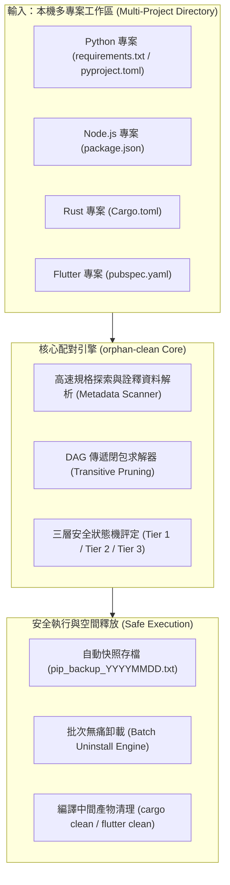

# orphan-clean

<div align="center">
  
  <br><br>
  <h1>orphan-clean</h1>
  <p><b>Safely audit polyglot project dependencies, purge orphan packages, and reclaim gigabytes of build bloat.</b></p>
  <p>跨語言多專案依賴安全審計、DAG孤兒套件清除與磁碟空間釋放工具</p>

  <p>
    <a href="https://opensource.org/licenses/MIT"></a>
    
    
    
    <a href="https://www.buymeacoffee.com/whoami885" target="_blank"></a>
  </p>

  <p>
    <a href="https://www.buymeacoffee.com/whoami885" target="_blank">
      
    </a>
  </p>
</div>

---

## 📖 目錄 (Table of Contents)

- [⚡ 為什麼需要 orphan-clean？ (The Problem)](#-為什麼需要-orphan-clean-the-problem)
- [✨ 核心特色 (Key Features)](#-核心特色-key-features)
- [🚀 快速開始 (Quickstart)](#-快速開始-quickstart)
  - [1. 視覺化 Web 控制台 (GUI Mode)](#1-視覺化-web-控制台-gui-mode-最推薦)
  - [2. 終端命令列 (CLI Mode)](#2-終端命令列-cli-mode)
- [🛡️ 三層安全防禦分類 (Safety Architecture)](#️-三層安全防禦分類-safety-architecture)
- [🏛️ 系統運作架構圖 (Architecture)](#️-系統運作架構圖-architecture)
- [🌐 多語言支援生態 (Polyglot Ecosystem)](#-多語言支援生態-polyglot-ecosystem)
- [📦 打包獨立執行檔 (.exe Build Guide)](#-打包獨立執行檔-exe-build-guide)
- [☕ 支持與贊助 (Support & Sponsorship)](#-支持與贊助-support--sponsorship)
- [⚖️ 開源授權協議 (License)](#️-開源授權協議-license)

---

## ⚡ 為什麼需要 orphan-clean？ (The Problem)

現代軟體工程師的主機經常同時並存著數十個專案。隨著時間推移，開發環境往往面臨三大慢性病：

1. **全域套件垃圾堆（Global Pollution）**：本機全域 Python 安裝了數百個函式庫，但根本不知道哪些專案真的在用，哪些是幾年前測試後遺留下來的「孤兒套件（Orphan Packages）」。
2. **誤刪恐懼（Fear of Breaking OS/IDE）**：害怕使用暴力清理工具會不小心把系統核心套件（`pip`, `setuptools`, `pywin32`, `pydantic`, `mcp`）刪除，導致 VSCode、Jupyter、AI Agent 或系統腳本崩潰。
3. **編譯贅肉吃爆硬碟（Build Bloat）**：Rust 的 `target/` 和 Flutter 的 `build/` 資料夾動輒數十 GB，常在不知不覺中吃光整顆固態硬碟（SSD）的空間。

**`orphan-clean`** 專為解決上述痛點而生，以**「精準配對、安全第一、零外部重型依賴」**為最高準則。

---

## ✨ 核心特色 (Key Features)

- 🔍 **跨語言多專案智慧探索**：
  一鍵遞迴掃描任意目錄下的所有專案清單（`requirements.txt`, `pyproject.toml`, `package.json`, `Cargo.toml`, `pubspec.yaml`）。
- 🌳 **DAG 傳遞閉包依賴分析（Transitive Closure Pruning）**：
  基於有向無環圖遞迴解析依賴樹。例如：若專案引用 `pandas`，系統會自動將其底層相依的 `numpy` 標記為「使用中」，絕不誤判！
- 🛡️ **三層安全防禦分類（Three-Tier Safety Classification）**：
  - **Tier 1 系統核心（強制保護）**：`pip`, `pywin32`, `mcp`, `pydantic` 等核心永遠鎖定禁止移除。
  - **Tier 2 CLI 開發工具（審慎檢閱）**：`black`, `pytest`, `ruff`, `pyinstaller` 等獨立工具。
  - **Tier 3 純外部庫（可安全卸載）**：真正無任何專案在用的純孤兒庫。
- 💾 **一鍵自動快照備份（Zero-Risk Rollback）**：
  任何卸載動作執行前，強制於背景執行 `pip freeze` 產生日誌保單，提供隨時「一鍵回滾（`pip install -r <snapshot>`）」。
- 🚀 **極致輕量本機 Web 控制台（Zero Heavy Dependencies）**：
  100% 基於 Python 內建標準庫 `http.server` 與現代 HTML5/CSS3，免安裝 Node.js 或龐大前端框架，雙擊即開即用！
- 💽 **多語言編譯贅肉大瘦身（Build Bloat Cleaner）**：
  掃描 Rust `target/` 與 Flutter `build/` 龐大機器碼暫存，一鍵釋放 20GB ~ 50GB 磁碟空間。

---

## 🚀 快速開始 (Quickstart)

### 1. 視覺化 Web 控制台 (GUI Mode, 最推薦)

直接雙擊根目錄下的 `run_gui.bat`，或在終端輸入：

```bash
python -m orphanclean.gui
# 或
orphan-clean --gui
```

系統將自動在預設瀏覽器開啟 **`http://127.0.0.1:8765`**，享受極致俐落的深色系極客儀表板！

---

### 2. 終端命令列 (CLI Mode)

```bash
# 1. 審計指定目錄並產出三層孤兒套件分類清單
python -m orphanclean.cli "D:\Developer\Projects" --orphans

# 2. 批次安全卸載孤兒套件 (自動備份保單)
python -m orphanclean.cli "D:\Developer\Projects" --clean-orphans

# 3. 匯出可安全移除之套件清單至純文字檔
python -m orphanclean.cli "D:\Developer\Projects" --export-orphans my_orphans.txt

# 4. 掃描 Rust (target/) 與 Flutter (build/) 編譯贅肉
python -m orphanclean.cli "D:\Developer\Projects" --bloat

# 5. 找出僅被少數專案引用的孤島套件 (<= 1 個專案)
python -m orphanclean.cli "D:\Developer\Projects" --low-freq 1
```

---

## 🛡️ 三層安全防禦分類 (Safety Architecture)

為確保使用者永遠不會因為清理孤兒套件而導致開發工具鏈崩潰，`orphan-clean` 內建防呆白名單：

| 分類級別 | 狀態標籤 | 涵蓋範例套件 | 系統處理原則 |
| :--- | :---: | :--- | :--- |
| **Tier 1: 核心保護** | `[LOCKED]` | `pip`, `setuptools`, `pywin32`, `pydantic`, `mcp`, `certifi`, `urllib3`, `ipykernel` | **永久鎖定禁止卸載**。Web 介面強制 Disabled Checkbox，CLI 強制攔截拒絕執行。 |
| **Tier 2: CLI 工具** | `[TOOL]` | `black`, `flake8`, `pytest`, `ruff`, `twine`, `pyinstaller`, `pipdeptree` | **獨立審閱**。提示使用者可能為全域終端工具，預設不勾選。 |
| **Tier 3: 純孤兒庫** | `[CLEAN]` | 無任何本機專案宣告、且無被其他套件依賴的歷史過期函式庫 | **可安全清理**。提供一鍵全選，卸載前自動建立 `pip freeze` 快照保單。 |

---

## 🏛️ 系統運作架構圖 (Architecture)



---

## 🌐 多語言支援生態 (Polyglot Ecosystem)

| 語言 / 生態系 | 宣告清單與鎖定檔 | 實體安裝與快取路徑 | 主要清理效益與目標 |
| :--- | :--- | :--- | :--- |
| **Python** | `requirements.txt`, `pyproject.toml` | 全域 `site-packages`, 專案 `.venv` | 清除久未使用的孤兒套件，淨化全域環境 |
| **Node.js** | `package.json`, `package-lock.json` | 全域 npm, 專案 `node_modules` | 審計全域 CLI 工具與相依配對 |
| **Rust** | `Cargo.toml`, `Cargo.lock` | 專案 `target/` | 一鍵清理巨大的機器碼快取（單一專案常達 5GB~20GB） |
| **Flutter / Dart** | `pubspec.yaml`, `pubspec.lock` | 專案 `build/`, `.dart_tool/` | 清除 Android Gradle 與 iOS/Web 預編譯贅肉 |

---

## 📦 打包獨立執行檔 (.exe Build Guide)

如果您希望在沒有安裝 Python 的電腦上隨插即用，可透過 PyInstaller 打包為單一檔案：

```bash
pip install pyinstaller
pyinstaller --onefile --noconsole --icon=assets/icon.ico orphanclean/gui.py -n orphan-clean
```

打包完成後的 `orphan-clean.exe`（約 15MB）隨身碟隨插即用，雙擊自動啟動本機控制台！

---

## ☕ 支持與贊助 (Support & Sponsorship)

如果您覺得 **`orphan-clean`** 幫您解決了電腦全域套件的陳年混亂、找回了數十 GB 甚至數百 GB 的硬碟空間，歡迎請作者喝杯咖啡支持持續維護！

<div align="center">
  <a href="https://www.buymeacoffee.com/whoami885" target="_blank">
    
  </a>
  <br><br>
  <p><b>Buy Me a Coffee ID:</b> <a href="https://www.buymeacoffee.com/whoami885"><code>whoami885</code></a></p>
  <p><b>聯絡與贊助信箱：</b> <code>whoami885@gmail.com</code></p>
</div>

您的慷慨贊助是我們持續完善多語言擴展架構（Go、Java/Kotlin）與維護開源生態的最大動力！❤️

---

## ⚖️ 開源授權協議 (License)

本專案採用 **[MIT License](LICENSE)** 開源授權協議。  
您可以自由商業使用、修改、分發與私有化部署，僅需保留原始著作權宣告。

```text
MIT License

Copyright (c) 2026 Knowledge-trend-research (whoami885@gmail.com)

Permission is hereby granted, free of charge, to any person obtaining a copy
of this software and associated documentation files (the "Software"), to deal
in the Software without restriction, including without limitation the rights
to use, copy, modify, merge, publish, distribute, sublicense, and/or sell
copies of the Software, and to permit persons to whom the Software is
furnished to do so, subject to the following conditions:
...
```
